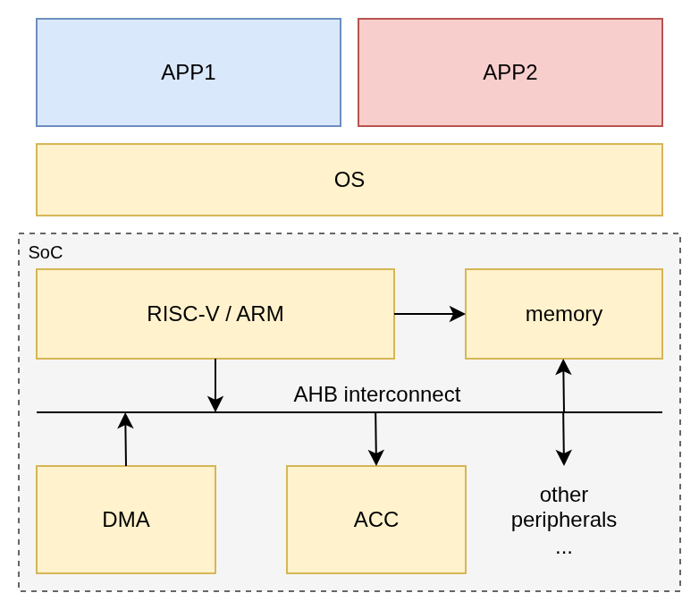
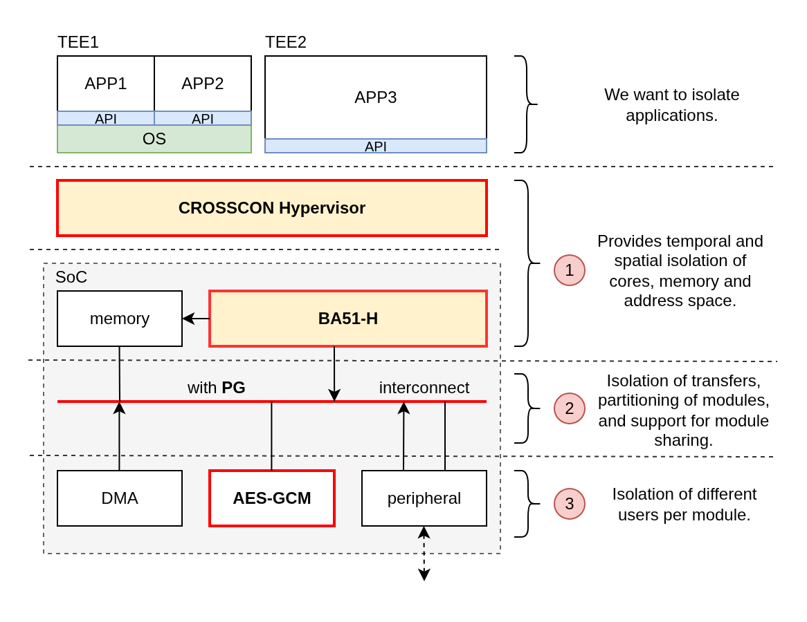
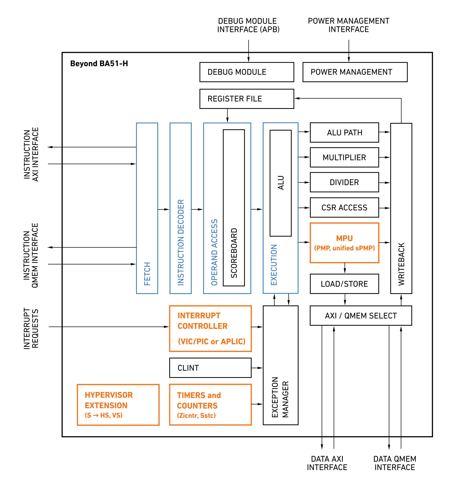
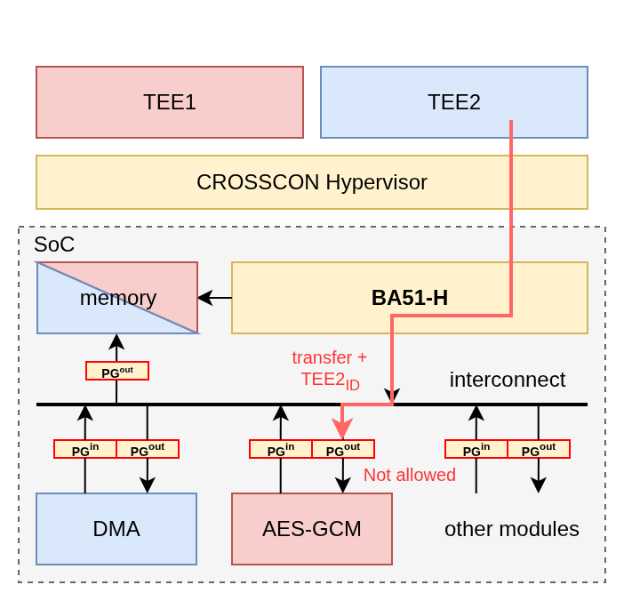
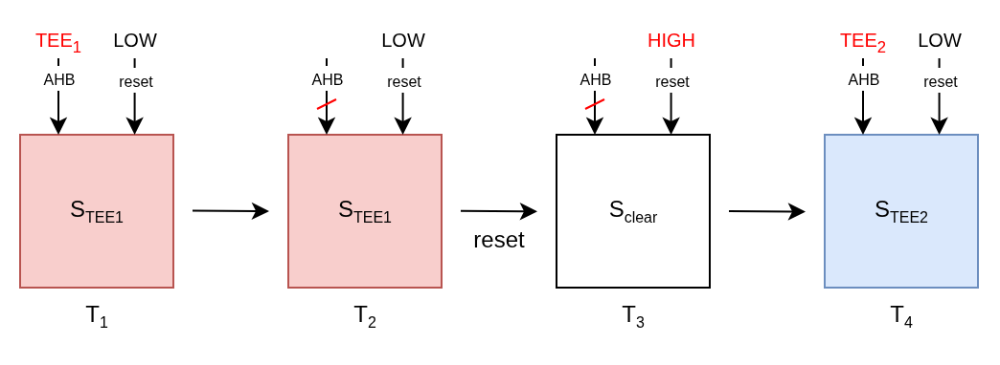
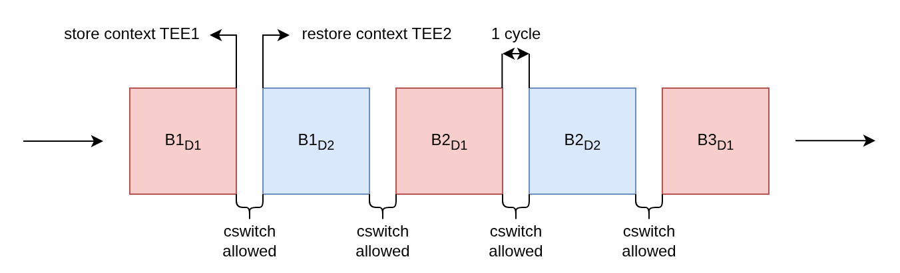
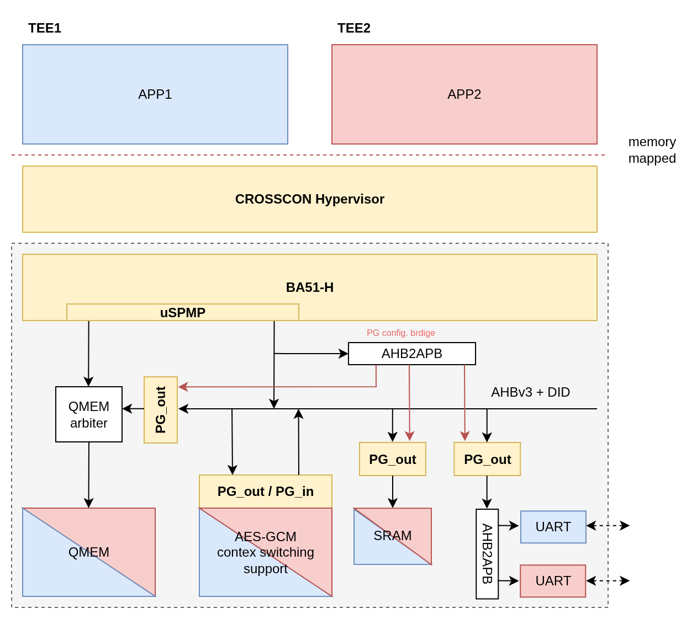

# Cross hardware-software stack isollation on low-end MCUs

There is a common trend in the industry where companies merge functionality, traditionally supported by multiple chips, into a single System-on-Chip (SoC). This is useful as it reduces costs, simplifies development and makes the system more flexible. But at the same time, it increases the attack surface, as more of the system resources are shared.

In a typical low-end MCU (e.g. RP2350 or CH32V203), which has an architecture similar to that shown in Figure 1, there are usually four key resources that are heavily shared between applications: (I) a processing core (RISC-V / ARM) that executes instructions, (II) memory that stores the data, (III) interconnect that connects hardware modules, and (IV) hardware modules that provide specific functionality  -- such as DMAs, accelerators, and peripherals. Each time an application runs, it uses several of these resources and changes their state. If resources are shared, subsequent applications can learn from those changes and infer what other other applications are doing (Footnote 1). Furthermore, applications can influence each other's behavior by restricting access to resources or through more subtle interference. These issues are well known and ignoring them undermines trust in the applications running on our systems.

    

Figure 1: A typical architecture of low-end MCUs

There are already existing solutions addressing this problem on the market that are appropriate for low-end MCUs, the most well-known are [ARM's TrustZone](https://sandro2pinto.github.io/files/acmcsur2019-tz.pdf) and [SiFive's WorldGuard](https://lists.riscv.org/g/tech-tee/attachment/266/0/WorldGuard%20High-level%20specification.pdf). Both solutions partition system's resources into different domains, where all the resources within a domain can freely interact with each other, but the interaction between domains is limited. This separation helps control the flow of information and ideally isolates software running in different domains.

We like the idea of partitioning resources into domains as it is intuitive and it aligns with what we are trying to do: reduce the attack surface by limiting possible interactions between different parts of a system. However, resources often need to be shared, which is problematic because sharing can introduce multiple attack vectors that are dificult to address [[2]](https://meltdownattack.com/)[[3]](https://informatik.rub.de/veroeffentlichungenbkp/emsec/veroeffentlichungen/2010/pdfs/2010_Differential_Cache_Collision_Timing_Attacks_on_AES_with_Applications_to_Embedded_CPUs.pdf)[[4]](https://bustedattack.com/)[[5]](https://www.usenix.org/system/files/conference/usenixsecurity14/sec14-paper-yarom.pdf). While it is true that some of these attacks cannot be used on low-end MCUs, that lack certain hardware features like cache and branch prediction, the underlying issue remains the same: applications can leverage changes made by other applications to learn something about them. With this in mind, we think that existing solutions do not place enough emphasis on how to share hardware resources safely.

As part of the [CROSSCON project](https://crosscon.eu/), we examined how to safely share resources through the entire hardware-software stack while preserving isolation between applications. We focused on the RISC-V architecture because it is open and we already have a line of cores, called [BA5x](https://www.cast-inc.com/press-releases/cast-enhances-risc-v-processor-line-low-power-and-functional-safety-applications), that we can work with. However, similar approaches can be applied to other architectures and MCUs with additional hardware features (caches, branch prediction, interconnects, accelerators, etc.). Our solution consists from three major components that address different parts of the hardware-software stack, as shown in Figure 2. We begin with the BA51-H core and go through the other solutions in turn.

    

Figure 2: How our solution addresses different levels of the hardware-software stack.

**Design goals**: In order for the solution to be adopted, it needs to (I) have a small hardware footprint, (II) be simple to understand and easy to use, (III) prevent entire families of attacks, and (IV) have a low overhead. Otherwise, the solution will not be adopted by the market, as the benefits would not outweigh the downsides and the same guarantees can be obtained in a less expensive way.

**Processing core**: A processing core, or simply a core, is a hardware unit that executes software instructions. When multiple applications need to run on the same core, the core must be shared, and we need a mechanism to isolate each application. This is usually handled by an operating system, but operating systems typically [expose a large attack surface](https://fly.io/blog/sandboxing-and-workload-isolation/) because they also provide additional functionality -- such as hardware virtualization, resource arbitration, and networking stacks -- which increases their complexity. However, because we want to minimize the attack surface, using a traditional operating system is not an option. It is better to use something with a much smaller software footprint. Fortunately, some hypervisors are designed specifically with this goal in mind (Footnote 3).

In collaboration with the [Centro ALGORITMI](https://algoritmi.uminho.pt/) team at the University of Minho -- the developers of the Bao hypervisor -- we developed an efficient method for setting up trusted execution environments (TEE) (Footnote 4) on low-end RISC-V MCUs. The main idea behind our approach is to use only a small set of hardware extensions and a lightweight hypervisor to efficiently isolate and restrict applications. This allows us to preserve a small hardware footprint and reduce the attack surface. The hypervisor should only provide the necessary functionality to isolate and restrict applications, and if there is only one processing core, it should also schedule when applications receive time on the core. All other functionality should be part of an application running in a TEE; for example, the networking stack should be included within the application itself.

Being able to easily set up lightweight TEEs is extremely useful because it lets us split applications into small, isolated components. For example, the networking stack, sensor logic, business logic, and cryptographic functions can each run in their own TEE. A bug in the networking stack would then require attackers to also compromise other TEEs -- or the hypervisor -- to reach more sensitive parts of the system. This is what effective defense-in-depth looks like.

To enable TEEs on RISC-V, we leverage the Hypervisor extension and a dedicated hypervisor memory protection unit (MPU) called hSPMP to create an isolated environment for the hypervisor, while allowing applications to use Virtual User (VU) and Virtual Supervisor (VS) privilege levels. We use the hypervisor to virtualize the registers and configure the hSPMP to partition the address space between TEEs. Although the current Hypervisor specification does not support a dedicated hypervisor MPU, as it assumes the use of a memory management unit (MMU), there is a [draft specification [7]](https://lists.riscv.org/g/tech-arch-review/attachment/391/1/rv-spmp-for-hyp-spec.pdf) suggesting such a setup. The downside of using MPU instead of MMU is that we lose memory translation, but MPU offers several advantages that make it suitable for low-end MCUs, including simpler design, being easier to use, and having a smaller footprint. Additionally, to reduce the virtualization burden on the hypervisor, we use the Sstc extension to make the timer registers directly available in  Virtual Supervisor (VS) mode. We also opted to support compressed instruction set (C extension) to reduce the amount of memory required for software. As far as we know, this is a novel way for establishing light-weight TEEs on low-end RISC-V MCUs. You can read more about the approach [here [6]](https://crosscon.eu/sites/crosscon/files/public/content-files/2025-03/ewC2024.pdf).

We evaluated the proposed configuration by incorporating the necessary extensions into Beyond's [BA51](https://www.cast-inc.com/processors/risc-v/ba51) core (Figure 3). The results show that the number of gates needed to support the TEEs is low, especially when compared to the additional memory needed for a traditional operating system that offers similar security guarantees. According to the synthesis results, the added extensions account for 5.1% of the area of a feature-rich core (Footnote 5). When we include 64 KiB of SRAM, this percentage drops to 1.4% of the total area, which we consider a reasonable trade-off, especially in light of the alternatives. For more details, you can review the full synthesis results [here [6]](https://crosscon.eu/sites/crosscon/files/public/content-files/2025-03/ewC2024.pdf).

    

Figure 3: BA51-H architecture, where the newly added extensions are marked with orange

**Memory**: In our case, the memory setup is straightforward since there are no caches. The main task is to partition the memory among TEEs and ensure that this partitioning is enforced at all access points. As shown in Figure 2, memory can be accessed directly from the core, which is protected by hSPMP, and from the interconnect, which is secured by the Perimeter guard. More details on the Perimeter guard are provided in the following sections.

If the system included a cache for accessing external RAM or long-term storage (such as Flash), we would need additional protective measures, such as cache coloring, to mitigate side-channel attacks.

**Interconnect**: Next, let us examine the interconnect, which connects hardware modules and enables communication. Communication occurs by reading and writing values to specific addresses (Footnote 6), triggering a set of signals routed to the appropriate module based on the address. In protocols like AHB and AXI, commonly used for interconnect communication, these are referred to as transfers. But in general, we can think of transfers as messages that are exchanged between modules.

To enable a TEE to communicate with hardware modules on the interconnect while maintaining the isolation provided by BA51-H and the hypervisor, two issues must be addressed. First, we must prevent modules from eavesdropping on transfers not intended for them, as failure to do so could expose which data a TEE is reading or writing. Second, we need to control which modules can communicate with each other; otherwise, modules could directly access data from other modules. Without these safeguards, the TEE's isolation would be compromised, allowing other TEEs or modules to observe the transferred data.

First, the interconnect provides secure point-to-point communication by design (Footnote 7), assuming it is properly configured, so confidentiality of transfers is not an issue. Second, we can traditionally control module communication using MMU and IOMMU units, if available. However, based on our experience, configuring MMU and IOMMU complicated and error-prone as we need to coordinate multiple MMU and IOMMU modules to restrict access to a single module, and all MMUs and IOMMUs must be configured correctly to block a specific address range. This makes MMUs and IOMMUs difficult to work with and often leads to errors that are hard to catch. Ideally, we'd prefer a simpler solution that allows us to easily specify which modules can communicate with each other and prevent communication with others.

To address that, we use a solution similar to the one used in [TrustZone](https://sandro2pinto.github.io/files/acmcsur2019-tz.pdf) and [WorldGuard](https://lists.riscv.org/g/tech-tee/attachment/266/0/WorldGuard%20High-level%20specification.pdf). Each transfer over the interconnect is tagged with the identifier (ID) of the module that sent it, enabling us to filter the transfers before they reach the intended module based on the sender’s ID. This is convenient as it allows us to easily configure who has access the module by adding the module's ID to the "allow access" list, and the transfers are filtered just before reaching the module, providing a single enforcement point. This eliminates the need to configure several, relatively complex security mechanisms (e.g. MMU and IOMMU) to restrict access. Third, the solution is scalable because the hardware and software costs are minimal. We simply add a small hardware module to handle tagging and filtering in front of each module connected to the interconnect.

In our setup, we refer to this solution as _Perimeter guard_ (PG) (Figure 5), which we use to group the hardware modules into _domains_. We extend this concept to TEEs, allowing each module to identify the TEE from which a transfer originates. This provides a simple way to assign a hardware module to a specific TEE and ensure that no other TEE can access it.

    

Figure 4: Illustration of how the Perimeter Guard is used to isolate modules at the interconnect level. When TEE2 attempts to access the AES-GCM module, which is currently assigned to TEE1, the transfer is blocked.

Tagging transfers with the ID of the sending module or TEE offers an additional benefit. The module can use this ID to adjust its behavior based on the sender. For example, it can maintain separate sets of registers, accessible only to specific TEEs, ensuring that data remains isolated and preventing potential information leaks between TEEs. Basically, this mechanism allows modules to enforce isolation at the module level, which is essential if we want to share modules between multiple TEEs.

**Sharing individual hardware modules**: There are primarily two ways we can share a hardware module: _spatial_ and _temporal sharing_. In spatial sharing, we divide the module's resources among different TEEs, whereas in temporal sharing, a single TEE uses all the resources of a module for a limited period before another TEE takes over. Both approaches have their advantages and are often combined when sharing resources. However, in our case, where we aim to share existing modules, temporal sharing is easier to apply since spatial sharing typically requires a major redesign of the module to ensure the module's resources are isolated.

The main issue with temporal sharing is that a TEE modifies the module's state when using it. Subsequent TEEs can exploit those changes; for example, by reading the module's registers if the previous TEE did not clear them. This kind of state-related attacks can be mitigated if we can find a way to adjust the module's state before assigning it to another TEE. Note that most hardware modules do not provide explicit, software accessible support for clearing or modifying their internal state, but this is something that we might be able to address.

(_Resetting the module_) Our first idea is to use the module's reset signal to clear the module's state. This approach is attractive since it requires no modifications to the module itself. Additionally, most modules typically have a reset signal, so we can use this approach with nearly any module, which is perfect for what we are trying to do. We would simply reset the module each time we allow another TEE to access it, ensuring that the next TEE cannot extract any information from its state.

    

 Figure 5: Module's state over time during reset

In general, this approach has two downsides. First, some modules do not reset the entire state; for example, large memory regions are often left uncleared (Footnote 8). Second, an application might need to reprovision the module after each reset, which can be costly if the module is frequently switches between TEEs. Addressing either issue requires partial redesign of the module. We try to address the second problem with our next idea.

(_Context switching_) Our second idea is to preserve the module’s state instead of resetting it whenever another TEE uses the module, thereby eliminating the reprovisioning overhead. This approach mirrors thread context switching, which enables multiple applications to share a single CPU core. For this approach to be possible, the module must provide a way to read and set its internal state. Before switching the module to a different TEE, we save its current state and, after the original TEE regains access, we restore the saved state. We refer to this mechanism as context switching, and to evaluate how difficult it is to add to an existing module, we attempted to implement it in our AES-GCM accelerator.

AES‐GCM is a widely used authentication cipher based on AES algorithm and Galois/Counter Mode (GCM). It supports both encryption and decryption while also providing message authentication. For our initial AES‐GCM implementation, we used Beyond's AES‐GCM accelerator, which is built around a simple AES module capable of processing a single 128‐bit block at the time (Footnote 9). We extended the accelerator with support for context switching which allows its internal state — also referred to as the context — to be swapped on a per-block basis as illustrated in Figure 6. To achieve this, the module’s interface has been extended with with additional signals that allow reading and setting the module's context, along with a `cswitch_allowed` signal that indicates when the context switch may safely occur. This design enables the module to interleave blocks from several messages belonging to different TEEs. Each TEE has its own dedicated AES-GCM context, which is accessible exclusively to that TEE, ensuring that no other TEE can access or infer information directly from it.

    

 Figure 6: Interleaving of blocks from different TEEs through context switching.

At first glance, adding context switching support to any module seems straightforward -- just identify the registers and add read and write signals. In practice, however, it's more complicated, because all those signals need to be routed outside the module, which consumes area on the chip that may be used elsewhere. Furthermore, we also want to minimize the amount of state we store, which requires understanding the module well enough to identify a moment when its state is smallest. For AES-GCM, this occurs between blocks, when no block-specific data is held by the module. This allows us to only store 583 bits of the module's state, which includes all the cryptographic material (key, IV, etc.) and the rest of the state needed to process a message.

Adding the context switching support does not effect the accelerator's processing speed, which remains 17 cycles per block for 256-bit keys (7.18 Mbs/MHz). Furthermore, the context switching itself only takes 1 cycle, which is the best outcome that we could have hoped for. The area of the module increased by 11.4%.

So far, we have only addressed the modifications needed to support context switching, but we still needed to integrate the accelerator into the SoC. We connected the module to the interconnect, implemented an appropriate interface so it can be used by software, added logic to drive the context switching, and a place to store two contexts. Once implemented, the module can be accessed by TEE, sending messages block by block to the accelerator.

With the additional logic, the module's are increased by 48.4%, while the speed dropped to 33 cycles per block (3.70 Mbs/MHz). Note that the area increase is not only due to context switching, but also because of the module's integration into the SoC, which needed to be done either way. We estimate that the are increase from context switching alone is notably lower than 48.4%. Additionally, the 33 cycles needed to process a block could be further reduced through design optimization bringing the time much closer to 17 cycles per block. Overall, with the optimization, context switching offers a good trade-off between additional utilization of the accelerator and the area increase.

**CROSSCON SoC**: To demonstrate how the developed solutions work together to provide cross hardware-software stack isolation, we integrated them into an SoC called _CROSSCON SoC_. The bitstream for the SoC is available on [GitHub](https://github.com/crosscon/crosscon_soc). Figure 7 shows a high-level overview of the architecture of the CROSSCON SoC.

    

Figure 7: High-level architecture of the CROSSCON SoC where red and blue indicate TEEs to which resources currently belongs to.

**Conclusion**: In our experience, redesigning parts of our chips enables stronger security with minimal overhead. By utilizing TEEs on RISC-V architecture and Perimeter Guard, we can easily isolate software components, reducing the impact of a breach while preserving resource utilization. We hope more companies adopt similar approaches to strengthen the security of embedded systems.

**Footnotes:**
- Footnote 1: A useful way to reason about how information is spread through a system is to think about it as [information flow [1]](https://dl.acm.org/doi/pdf/10.1145/3447867). This idea is commonly used in the literature to capture various ways information is spread.
- Footnote 2: Ideally, each domain would have all the resources it needs to implement a specific functionality without needing to share them. However, this would bring us close to the situation we had at the start, where each functionality was supported by a separate chip.
- Footnote 3: You’ll often hear about hypervisors in the context of cloud computing, where systems like [KVM](https://linux-kvm.org/page/Main_Page) and [Xen](https://xenproject.org/) allow servers to run multiple operating systems on a single CPU. Recently, however, these concepts have also been applied to microcontrollers, with the [Bao hypervisor](http://www.bao-project.org/) being a notable example designed specifically for such a use-case.
- Footnote 4: In the literature, TEE often refers to an isolated execution environment that also supports attestation, allowing users to verify that the environment and its software are correctly configured. In our usage, however, TEE refers only to the isolated execution environment itself; attestation can be provided separately by using another TEE for measurement and signing.
- Footnote 5: A feature-rich BA51 core configuration includes the following components: APLIC (8 interrupts), Debug module, Power management, PMP with 16 entries (16e), unified sPMP with 16 entries (16e), Memory debugger, CLINT, 8 Triggers, Sstc, Trace, and modes for M, S, U, and H (without virtual memory). It also supports the following extensions: A, C, F, H, I, M, N, Sspmp, Sstc, Zc, Zicntr, Zicsr, and Zifencei.
- Footnote 6: From the software perspective, a hardware module can be accessed by executing a read or write instruction to the address where the module's registers are mapped to.
- Footnote 7: Typically, interconnects do not explicitly guarantee secure communication, as hardware designers aim to minimize gate usage, often leaving out filtering logic. As a result, most signals are continuously routed to all modules, and it is up to the modules to sample only transfers addressed to them. We trust that this is the case for all modules connected to the interconnect.
- Footnote 8: This reflects hardware designers’ efforts to minimize the number of gates required to implement a module. As a result, registers are often not reset if they are not essential for the behaviour of the module after the reset.
- Footnote 9: The module does not use pipelining, so a new block can be passed to the module after the previous block was processed. The module has a fairly standard architecture: each round of the AES algorithm is performed in one clock cycle. In addition, the module uses 3 extra cycles for pre‐ and post‐process, resulting in a total of 13 (10 + 3) cycles for 128‐bit keys and 17 (14 + 3) cycles for 256‐bit keys.

**References**:
- [1] Hu, W., Ardeshiricham, A., Kastner, R., 2021. Hardware Information Flow Tracking 54.. https://doi.org/10.1145/3447867
- [2] https://meltdownattack.com/
- [3] Bogdanov, Andrey, et al. "Differential cache-collision timing attacks on AES with applications to embedded CPUs." Cryptographers’ Track at the RSA Conference. Berlin, Heidelberg: Springer Berlin Heidelberg, 2010.
- [4] Rodrigues, Cristiano, Daniel Oliveira, and Sandro Pinto. "Busted!!! microarchitectural side-channel attacks on the MCU bus interconnect." 2024 IEEE Symposium on Security and Privacy (SP). IEEE, 2024. https://bustedattack.com/
- [5] Yarom, Yuval, and Katrina Falkner. "{FLUSH+ RELOAD}: A high resolution, low noise, l3 cache {Side-Channel} attack." 23rd USENIX security symposium (USENIX security 14). 2014.
- [6] Sandro Pinto and Matjaž Breskvar. "A Novel Trusted Execution Environment
for Next-Generation RISC-V MCUs" Embedded world 2024
- [7] Bicheng Yang and José Martins. "RISC-V S-mode Physical Memory Protection for Hyperviso". v0.2
