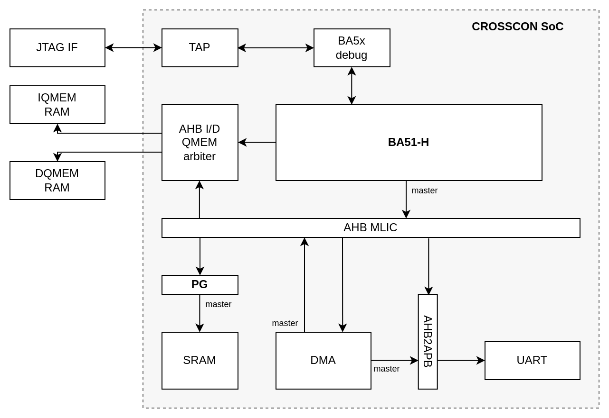
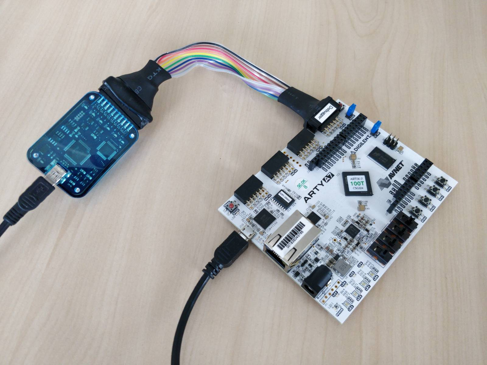

# CROSSCON SoC

Here you can find the initial version of the _CROSSCON SoC_: a system-on-chip (SoC) developed as part of the [CROSSCON project](https://crosscon.eu/). The repository contains an overview of the CROSSCON SoC, its bitstream and instructions on how to use it with the Arty-A7 100T board. For a detailed description of the CROSSCON SoC, please refer to deliverable D4.1 "CROSSCON Extensions to Domain Specific Hardware Architectures Documentation — Draft". This repository is a part of deliverable D4.2 "CROSSCON Extension Primitives to Domain Specific Hardware Architectures — Initial Version". 

## Overview

**CROSSCON SoC** is a SoC design, developed as part of the [CROSSCON project](https://crosscon.eu/), that provides a secure RISC-V execution environment for mixed-criticality IoT devices that require strong software (SW) and hardware (HW) isolation, flexibility, small code size and low power consumption. The CROSSCON SoC supports strong software isolation through virtualization-based trusted execution environments (TEEs) where HW modules connected to the interconnect can be shared between TEEs without compromising isolation.

<p align="center">
    
</p>
<p align="center">Figure 1: The current architecture of the CROSSCON SoC</p>

Figure 1 shows a high-level architecture of the current version of the CROSSCON SoC. The CROSSCON SoC is built around the [Beyond Semiconductor's BA51](https://www.cast-inc.com/processors/risc-v/ba51) RISC-V core and includes all the necessary infrastructure that one needs to develop embedded applications (e.g. JTAG support and UART).

BA51-H contains the fist implementation of the unified (2-stage) SPMP unit, which is one of the possible SPMP candidates for the standardization as part of the [RISC-V SPMP standardization effort](https://github.com/riscv/riscv-spmp?tab=readme-ov-file). We have extended Spike simulator, the golden model of RISC-V specification, with the unified (2-stage) SPMP extension, which servers a reference implementation of the unified SPMP model and allows us to obtain a reference execution environment for the BA51-H core. The extended Spike can be configured to simulate `rv32imafch_spmp_sstc_zc_zicntr` ISA and is available as a [separate repository](https://github.com/crosscon/riscv-isa-sim).

Furthermore, the CROSSCON SoC contains the first prototype implementation of **Perimeter guard (PG)**: a mechanism that allows to share HW modules between VMs while preserving their isolation. PG is a HW module placed between the SoC interconnect and a HW module that we want to share, as, for example, cryptographic accelerator. It can be used to control which VMs and bus masters can access the module; and further, allows the HW module to be "reset" before giving access to the module to a different VM / master. Resetting the module's state prevents any state related information flows through the HW module. PG is planned to support several modes of operation, whereas the current prototype only supports time-sharing with reset mode with lock-release arbitration. In the current version of the CROSSCON SoC, as shown in Figure 1, we use PG to control access to SRAM so that it can be shared between different VMs without compromising their isolation.

A more detailed description of the CROSSCON SoC, BA51-H and PG can be found in deliverable D4.1 "ROSSCON Extensions to Domain Specific Hardware Architectures Documentation — Draft" of the [CROSSCON project](https://crosscon.eu/).

## Running the examples

You can try out the CROSSCON SoC by running it on the Arty-A7 100T board with one of the example programs. To run an example you need to:
1. Upload the CROSSCON SoC's bitstream to the Arty-A7 100T board.
2. Build the example for the BA51-H core.
3. Connect a debug key to the BA51-H, upload the binary of the example and run it.

Here we'll cover how to get the basic Perimeter guard example running. Note that some of the examples might have more specific instructions.

We assume that you are following the instructions on a PC with a working Ubuntu or Debian OS setup.

First, download this repository by running:
```bash
git clone https://github.com/crosscon/crosscon_soc
```

## How to upload the bitstream

The CROSSCON SoC's bitstream can be uploaded to the Arty-A7 100T board using the [OpenOCD](https://openocd.org/). You can install openocd by `sudo apt install openocd`. Note that you need use openocd v0.12 or newer.

Connect the Arty-A7 board with your PC using a USB-to-micro-USB cable via the USB-JTAG port. See [the Arty-A7 reference manual](https://digilent.com/reference/programmable-logic/arty-a7/reference-manual) for the overview of the Arty-A7 board.

Upload the bitstream by going to the `crosscon_soc/scripts/upload_bits` folder and running:
```bash
./upload.sh ../../bits/crosscon_soc_a7_v0.1.bit
```

If the bitstream was uploaded successfully, you should see an output similar to the following:
```bash
Open On-Chip Debugger 0.12.0
Licensed under GNU GPL v2
For bug reports, read
	http://openocd.org/doc/doxygen/bugs.html
Info : auto-selecting first available session transport "jtag". To override use 'transport select <transport>'.
jtagspi_program
Info : clock speed 5000 kHz
Info : JTAG tap: xc7.tap tap/device found: 0x13631093 (mfg: 0x049 (Xilinx), part: 0x3631, ver: 0x1)
```
and the "DONE" LED of the Arty-A7 board should be illuminated green. 

## Setup the RISC-V toolchain

Checkout the [RISC-V toolcahin](https://github.com/riscv/riscv-gnu-toolchain) repository and compile it:
```
git clone https://github.com/riscv/riscv-gnu-toolchain
cd riscv-gnu-toolchain
mkdir install_dir
./configure --prefix=$(pwd)/install_dir --with-arch=rv32imafc_zicsr_zifencei_zca --with-abi=ilp32f --with-target-cflags=-g --with-target-cxxflags=-g '--with-multilib-generator=rv32imac-ilp32--; rv32imafc_zca-ilp32--; rv32imac_zicsr_zifencei_zca-ilp32--;'
make
```

Note that the toolchain will use the `rv32imacf_zca_zcb_zcf` ARCH and the `ilp32f` ABI by default.

When compiled, the toolchain will be available in the `riscv-gnu-toolchain/install_dir` directory. Set the RISCV environment variable to `bin` directory of the compiled toolchain where the `riscv32-unknown-elf-*` commands are available:
```
export RISCV=/path/to/riscv-gnu-toolchain/install_dir/bin
```

## Build the example program

Go to the examples directory `crosscon_soc/examples/cs_pg_example` and run
```
./build.sh
```

If the example was compiled successfully, the last line of the output should be `# Done.`.

## Upload and run the binary

In order to run the example, we need to upload it's binary to the CROSSCON SoC's memory using a JTAG compatible debug key.

First, connect the debug key to the Arity-A7's JD port, as shown by the picture below, and to your PC via a USB-to-micro-USB cable.

<p align="center">
    
</p>
<p align="center">Figure 2: Development setup</p>

For the following instructions, we assume that you are using [Beyond's debug key](https://www.beyondsemi.com/beyond-debug-key/) with the appropriate cable that has the following pinout on the side that connects to the Arty-A7's JD Pmod port:

<p align="center">
    
</p>
<p align="center">Figure 3: Arty-A7's Pmod pin layout (looking from outside of PCB edge)</p>

<div align="center">

| Pin | Signal | Type |
| --- | ------ | ---- | 
| 1   | TDO    | Output |
| 2   |	| |
| 3   | TCK/SWCLK | Input |
| 4   | TX | Output |
| 7   | TDI | Input |
| 8   | TMS/SWDIO | Input |
| 9   | nTRST | Input |
| 10  | RX | Input |

</div>

<p align="center">Table 1: Required JTAG pin input for the Arty-A7's JD Pmod port where Input and Output types denote input/output to/from the targeted JTAG port.</p>

If you are using some other debug key, the following instructions might not work out of the box, so you'll need to do a bit of research, but the main idea is to use the OpenOCD to connect to the BA51-H using GDB over the debug key.

### Run the OpenOCD

Run the OpenOCD server so that we'll be able to talk to the debug key using GDB:
```bash
openocd -f ../../scripts/openocd/crosscon_soc.openocd.cfg
```

You should see 
```
Open On-Chip Debugger 0.12.0-snapshot (2024-02-16-12:42)
Licensed under GNU GPL v2
For bug reports, read
	http://openocd.org/doc/doxygen/bugs.html
Info : clock speed 3000 kHz
Info : TAP riscv.cpu does not have valid IDCODE (idcode=0xfffffffe)
Info : datacount=2 progbufsize=0
Warn : We won't be able to execute fence instructions on this target. Memory may not always appear consistent. (progbufsize=0, impebreak=0)
Info : Examined RISC-V core; found 1 harts
Info :  hart 0: XLEN=32, misa=0x401411a5
Info : starting gdb server for riscv.cpu on 3333
Info : Listening on port 3333 for gdb connections
Ready for Remote Connections
Info : Listening on port 6666 for tcl connections
Info : Listening on port 4444 for telnet connections
```

Open another terminal.

## Listen on UART

In the case of Beyond's debug key, the UART port is exposed as a device file /dev/ttyUSBx.

We'll use [tio](https://github.com/tio/tio) to interact with it. You can install the `tio` by running
```bash
sudo apt install tio
```

You can list the available /dev/ttyUSBx devices by running:
```
tio --list
```

You should see something similar to
```
Device            TID     Uptime [s] Driver           Description
----------------- ---- ------------- ---------------- --------------------------
/dev/ttyUSB1      aOSQ      9969.776 ftdi_sio         Digilent USB Device
/dev/ttyUSB3      CJFY      9965.260 ftdi_sio         Debug Key
```
In the case of Beyond's debug key, we are looking for a device with `Debug Key` description.

Once you know which device file is the right one, run
```
./listen_on_uart.sh /dev/ttyUSBx
```
where `/dev/ttyUSBx` is replaced with the actual device file path.

You should see something similar to
```
[09:41:50.690] tio v3.3
[09:41:50.690] Press ctrl-t q to quit
[09:41:50.699] Connected to /dev/ttyUSB1
```

Open another terminal.

## Upload the program using GDB and run the program.

Run
```
./run_gdb.sh
```

You should see something similar to
```
GNU gdb (GDB) 15.0.50.20240107-git
Copyright (C) 2023 Free Software Foundation, Inc.
License GPLv3+: GNU GPL version 3 or later <http://gnu.org/licenses/gpl.html>
This is free software: you are free to change and redistribute it.
There is NO WARRANTY, to the extent permitted by law.
Type "show copying" and "show warranty" for details.
This GDB was configured as "--host=x86_64-pc-linux-gnu --target=riscv32-unknown-elf".
Type "show configuration" for configuration details.
For bug reporting instructions, please see:
<https://www.gnu.org/software/gdb/bugs/>.
Find the GDB manual and other documentation resources online at:
    <http://www.gnu.org/software/gdb/documentation/>.

For help, type "help".
Type "apropos word" to search for commands related to "word"...
Reading symbols from Debug/cs_pg_example.elf...
Remote debugging using localhost:3333
_enter () at ../src/entry.S:38
38		la gp, __global_pointer$
TAP riscv.cpu does not have valid IDCODE (idcode=0xfffffffe)
Loading section .init, size 0x196 lma 0x0
Loading section .rodata, size 0x298 lma 0x198
Loading section .text, size 0x3eb0 lma 0x430
Loading section .data, size 0x544 lma 0x42e0
Start address 0x00000000, load size 18466
Transfer rate: 12 KB/sec, 3693 bytes/write.
Continuing.
```

Now the program was executed and if you setup everything correctly, you should see the following on UART
```
CROSSCON SoC: Running basic PG test ...
Trying to read and write to SRAM ...
Trying to access SRAM with the wrong DID ...
Interrupt was raised.
Trying to read and write to SRAM with a different DID ...
Test completed successfully.
```

Done.

## Licence

See LICENCE.txt file.

## Acknowledgments

The work presented in this repository is part of the [CROSSCON project](https://crosscon.eu/) that received funding from the European Union’s Horizon Europe research and innovation programme under grant agreement No 101070537.

<p align="center">
    
</p>

<p align="center">
    
</p>

