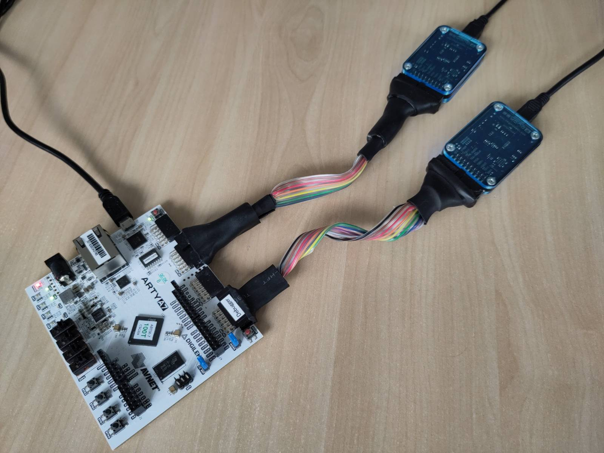

# CROSSCON Hypervisor with two guest VMs that use AES-GCM accelerator with full isolation

Here you can find an example setup of CROSSCON Hypervisor with two guests VMs that are fully isolated, including UART, and are using the AES-GCM accelerator to encrypt and decrypt a block of data at the same time.

## Prerequisites

Follow the instruction in [README.md](../../../README.md) to setup the cross-compilation toolchain, connect the Arty-A7 board and upload the CROSSCON SoC bitstream.

Note that the path to the RISC-V cross-compilation toolchain should be available through `RISCV` variable as described in Setup the RISC-V toolchain section of [README.md](../../../README.md).

Note that you need to listen on two different UART ports to see the output; one UART is available on Arty-a7's JD Pmod port, alongside the JTAG interface, and the other on the JB Pmod port. Figure 1 shows a basic setup with two Beyond debug keys. On JD Pmod port the TX and RX pins are available on F3 and G2 pins, and on the JB Pmod port on C16 and J15 respectively. Note that, you can listen on the UART ports with a standard UART-to-USB serial adapter.
 
<p align="center">
    
</p>
<p align="center">Figure 1: Development setup with two debug key</p>

## Setup and compile

Run
```
./setup.sh
```
and then
```
./build.sh 
```
to setup and build the source files.

## Upload and run

Run
```
./run_gdb.sh
```

Now the program was executed. If you setup everything correctly, you should see something similar to the following output.

Output from UART available on JD Pmod port:
```
...
   _____ _____   ____   _____ _____  _____ ____  _   _ 
  / ____|  __ \ / __ \ / ____/ ____|/ ____/ __ \| \ | |
 | |    | |__) | |  | | (___| (___ | |   | |  | |  \| |
 | |    |  _  /| |  | |\___ \\___ \| |   | |  | | . ` |
 | |____| | \ \| |__| |____) |___) | |___| |__| | |\  |
  \_____|_|  \_\\____/|_____/_____/ \_____\____/|_| \_|
  _    _                             _
 | |  | |                           (_)                
 | |__| |_   _ _ __   ___ _ ____   ___ ___  ___  _ __  
 |  __  | | | | '_ \ / _ \ '__\ \ / / / __|/ _ \| '__| 
 | |  | | |_| | |_) |  __/ |   \ V /| \__ \ (_) | |    
 |_|  |_|\__, | .__/ \___|_|    \_/ |_|___/\___/|_|    
          __/ | |                                      
         |___/|_| 11:15:46

CROSSCONHYP INFO: Initializing VM 0
CROSSCONHYP WARNING: trying to flush caches but the operation is not defined for this platform
CROSSCONHYP INFO: VM 0 adding MMIO region, VA: 0x10700000 size: 0xfffff mapped at 0x10700000
CROSSCONHYP INFO: VM 0 adding MMIO region, VA: 0x24000000 size: 0xfffff mapped at 0x24000000
CROSSCONHYP INFO: VM 0 adding MMIO region, VA: 0x20000000 size: 0xffffff mapped at 0x20000000
CROSSCONHYP INFO: VM 0 adding MMIO region, VA: 0x21000000 size: 0xffffff mapped at 0x21000000
CROSSCONHYP INFO: VM 0 is sdGPOS (normal VM)
CROSSCONHYP INFO: Initializing VM 1
CROSSCONHYP WARNING: trying to flush caches but the operation is not defined for this platform
CROSSCONHYP INFO: VM 1 adding MMIO region, VA: 0x11000000 size: 0xfffff mapped at 0x11000000
CROSSCONHYP INFO: VM 1 adding MMIO region, VA: 0x24000000 size: 0xfffff mapped at 0x24000000
CROSSCONHYP INFO: VM 1 adding MMIO region, VA: 0x20000000 size: 0xffffff mapped at 0x20000000
CROSSCONHYP INFO: VM 1 adding MMIO region, VA: 0x21000000 size: 0xffffff mapped at 0x21000000
CROSSCONHYP INFO: VM 1 is sdGPOS (normal VM)
scause = 10
[guest 0] Bare-metal test guest
additional data = 'Additional data of the guest vm 0'
msg = 'Testscause = 10
 message of the guest vm 0. Test message of the guest vm 0. Test message of the guest vm 0'
[guest 0] Encrypting ...
[guest 0] Done passing initial parameters.
[guest 0] data_out[0] (hex) = 0x0b8b5e7d9b287a29a845d5cd0c30c283
[guest 0] data_out[1] (hex) = 0xadf362d09c80e22e7726834c0b256822
[guest 0] data_out[2] (hex) = 0x4300f37ba965fbd3ed154aec5f2e2845
[guest 0] data_out[3] (hex) = 0x144ec7e22963a7946c9f95f1480722e4
[guest 0] data_out[4] (hex) = 0x7e5b397a394b79151d0ee3fd762e1cf2
[guest 0] data_out[5] (hex) = 0x1a947dd9231d6af00fa5279aa9967b7c
[guest 0] tag (hex) = 0x3dda769317e930acb2151044f9ca26c8

[guest 0] Decrypting ...
[guest 0] Done passing initial parameters.
[guest 0] data_out[0] (hex) = 0x54657374206d657373616765206f6620
[guest 0] data_out[1] (hex) = 0x74686520677565737420766d20302e20
[guest 0] data_out[2] (hex) = 0x54657374206d657373616765206f6620
[guest 0] data_out[3] (hex) = 0x74686520677565737420766d20302e20
[guest 0] data_out[4] (hex) = 0x54657374206d657373616765206f6620
[guest 0] data_out[5] (hex) = 0x74686520677565737420766d20307b7c
[guest 0] tag (hex) = 0x3dda769317e930acb2151044f9ca26c8
[guest 0] decrypted msg = 'Test message of the guest vm 0. Test message of the guest vm 0. Test message of the guest vm 0'
[guest 0] Done.
```

Output from UART available on JB Pmod port:
```
[guest 1] Bare-metal test guest
additional data = 'Additional data of the guest vm 1'
msg = 'Test message of the guest vm 1. Test message of the guest vm 1. Test message of the guest vm 1'
[guest 1] Encrypting ...
[guest 1] Done passing initial parameters.
[guest 1] data_out[0] (hex) = 0x67a7fc2a295ad1606ba14a0abafd7bcc
[guest 1] data_out[1] (hex) = 0x05d237e2ec08d8ea5fbdedb80d2983e2
[guest 1] data_out[2] (hex) = 0x7dd2309a742e5e45fc4deeb84c2f8268
[guest 1] data_out[3] (hex) = 0xec7ba1315eaf7ed602979c27255747c2
[guest 1] data_out[4] (hex) = 0xf534537bbdc07027b692e0107f8c04fd
[guest 1] data_out[5] (hex) = 0xe5455efee00662ae29097499c58e1c9d
[guest 1] tag (hex) = 0xa84a704cdf8b104bef0431b975faf694

[guest 1] Decrypting ...
[guest 1] Done passing initial parameters.
[guest 1] data_out[0] (hex) = 0x54657374206d657373616765206f6620
[guest 1] data_out[1] (hex) = 0x74686520677565737420766d20312e20
[guest 1] data_out[2] (hex) = 0x54657374206d657373616765206f6620
[guest 1] data_out[3] (hex) = 0x74686520677565737420766d20312e20
[guest 1] data_out[4] (hex) = 0x54657374206d657373616765206f6620
[guest 1] data_out[5] (hex) = 0x74686520677565737420766d20311c9d
[guest 1] tag (hex) = 0xa84a704cdf8b104bef0431b975faf694
[guest 1] decrypted msg = 'Test message of the guest vm 1. Test message of the guest vm 1. Test message of the guest vm 1'
[guest 1] Done.
```

## Memory layout

The SoC has 512KB of SRAM memory which is divided between the software stack in the following way:
- 0x00000 - 0x2ffff: OpenSBI (192KB)
- 0x30000 - 0x67fff: CROSSCON Hypervisor (224KB)
- 0x68000 - 0x73fff: Guest VM 1 (48KB) 
- 0x74000 - 0x7ffff: Guest VM 2 (48KB) 

## SoC architecture

You can find additional details about the CROSSCON SoC architecture in the README of [cs_hypervisor_with_aes_gcm_example](../cs_hypervisor_with_aes_gcm_example) example. 

The main difference between this and the [cs_hypervisor_with_aes_gcm_example](../cs_hypervisor_with_aes_gcm_example) example is that each VM uses a different UART to get full isolation; VM1 can only access UART 0 and VM2 can only access UART 1. Note that all the log output from OpenSBI and CROSSCON Hypervisor is printed to UART 0.
