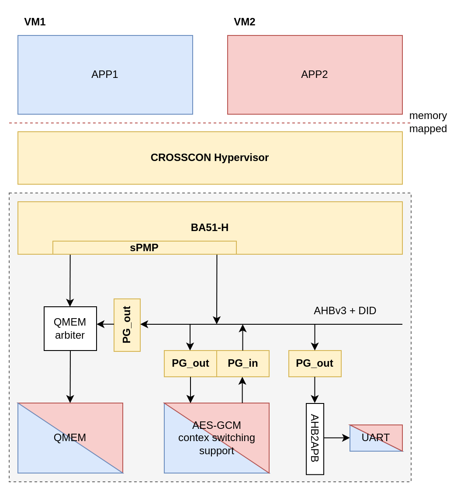

# CROSSCON Hypervisor with AES-GCM accelerator example

Here you can find an example setup of CROSSCON Hypervisor with two guests VMs that are using the AES-GCM accelerator at the same time.

## Prerequisites

Follow the instruction in [README.md](../../README.md) to setup the cross-compilation toolchain, connect the Arty-A7 board and upload the `crosscon_soc_a7_v0.4.2.bit` bitstream. Note that this bitstream has an different version of the CROSSCON SoC which architecture is described down below.

Note that the path to the RISC-V cross-compilation toolchain should be available through `RISCV` variable as described in Setup the RISC-V toolchain section of [README.md](../../README.md).

## Setup and compile

Move into the example's directory and run
```
./setup.sh
```
to setup the source files. You can compile the example by running
```
./build.sh 
```

## Upload and run

Connect to the CROSSCON SoC's UART port as described in Listen on UART section of [README.md](../../README.md).

Run
```
./run_gdb.sh
```

Now the program was executed. If you setup everything correctly, you should something similar to the following output on UART. Note that because the access to UART is not synchronized, your input might overlap.
```
...
   _____ _____   ____   _____ _____  _____ ____  _   _
  / ____|  __ \ / __ \ / ____/ ____|/ ____/ __ \| \ | |
 | |    | |__) | |  | | (___| (___ | |   | |  | |  \| |
 | |    |  _  /| |  | |\___ \\___ \| |   | |  | | . ` |
 | |____| | \ \| |__| |____) |___) | |___| |__| | |\  |
  \_____|_|  \_\\____/|_____/_____/ \_____\____/|_| \_|
  _    _                             _
 | |  | |                           (_)
 | |__| |_   _ _ __   ___ _ ____   ___ ___  ___  _ __
 |  __  | | | | '_ \ / _ \ '__\ \ / / / __|/ _ \| '__|
 | |  | | |_| | |_) |  __/ |   \ V /| \__ \ (_) | |
 |_|  |_|\__, | .__/ \___|_|    \_/ |_|___/\___/|_|
          __/ | |
         |___/|_| 17:59:30

CROSSCONHYP INFO: Initializing VM 0
CROSSCONHYP WARNING: trying to flush caches but the operation is not defined for this platform
CROSSCONHYP INFO: VM 0 adding MMIO region, VA: 0x10700000 size: 0xfffff mapped at 0x10700000
CROSSCONHYP INFO: VM 0 adding MMIO region, VA: 0x24000000 size: 0xfffff mapped at 0x24000000
CROSSCONHYP INFO: VM 0 is sdGPOS (normal VM)
CROSSCONHYP INFO: Initializing VM 1
CROSSCONHYP WARNING: trying to flush caches but the operation is not defined for this platform
CROSSCONHYP INFO: VM 1 adding MMIO region, VA: 0x10700000 size: 0xfffff mapped at 0x10700000
CROSSCONHYP INFO: VM 1 adding MMIO region, VA: 0x24000000 size: 0xfffff mapped at 0x24000000
CROSSCONHYP INFO: VM 1 is sdGPOS (normal VM)
[guest 0] Bare-metal test guest
additional data = 'Additional data of the guest vm 0'
msg = 'Test message of the guest vm 0. Test message of the guest vm 0. Test message of the guest vm 0'
[guest 1] Bare-metal test guest
additional data = 'Additional data of the guest vm 1'
msg = 'Test message of the guest vm 1. Test message of the guest vm 1. Test message of the guest vm 1'
[guest 0] Encrypting ...
[guest 1] Encrypting ...
[guest 0] Done passing initial parameters.
[guest 1] Done passing initial parameters.
[guest 0] Waiting for output data ...
[guest 0] data_out[0] (hex) = 0x0b8b5e7d9b287a29a845d5cd0c30c283
[guest 1] Waiting for output data ...
[guest 1] data_out[0] (hex) = 0x67a7fc2a295ad1606ba14a0abafd7bcc
[guest 0] Waiting for output data ...
[guest 0] data_out[1] (hex) = 0xadf362d09c80e22e7726834c0b256822
[guest 1] Waiting for output data ...
[guest 1] data_out[1] (hex) = 0x05d237e2ec08d8ea5fbdedb80d2983e2
[guest 0] Waiting for output data ...
[guest 0] data_out[2] (hex) = 0x4300f37ba965fbd3ed154aec5f2e2845
[guest 1] Waiting for output data ...
[guest 1] data_out[2] (hex) = 0x7dd2309a742e5e45fc4deeb84c2f8268
[guest 0] Waiting for output data ...
[guest 0] data_out[3] (hex) = 0x144ec7e22963a7946c9f95f1480722e4
[guest 1] Waiting for output data ...
[guest 1] data_out[3] (hex) = 0xec7ba1315eaf7ed602979c27255747c2
[guest 0] Waiting for output data ...
[guest 0] data_out[4] (hex) = 0x7e5b397a394b79151d0ee3fd762e1cf2
[guest 1] Waiting for output data ...
[guest 1] data_out[4] (hex) = 0xf534537bbdc07027b692e0107f8c04fd
[guest 0] Waiting for output data ...
[guest 0] data_out[5] (hex) = 0x1a947dd9231d6af00fa5279aa9967b7c
[guest 1] Waiting for output data ...
[guest 1] data_out[5] (hex) = 0xe5455efee00662ae29097499c58e1c9d
[guest 0] tag (hex) = 0x3dda769317e930acb2151044f9ca26c8
[guest 1] tag (hex) = 0xa84a704cdf8b104bef0431b975faf694

[guest 0] Decrypting ...
[guest 1] Decrypting ...
[guest 0] Done passing initial parameters.
[guest 1] Done passing initial parameters.
[guest 0] Waiting for output data ...
[guest 0] data_out[0] (hex) = 0x54657374206d657373616765206f6620
[guest 1] Waiting for output data ...
[guest 1] data_out[0] (hex) = 0x54657374206d657373616765206f6620
[guest 0] Waiting for output data ...
[guest 0] data_out[1] (hex) = 0x74686520677565737420766d20302e20
[guest 1] Waiting for output data ...
[guest 1] data_out[1] (hex) = 0x74686520677565737420766d20312e20
[guest 0] Waiting for output data ...
[guest 0] data_out[2] (hex) = 0x54657374206d657373616765206f6620
[guest 1] Waiting for output data ...
[guest 1] data_out[2] (hex) = 0x54657374206d657373616765206f6620
[guest 0] Waiting for output data ...
[guest 0] data_out[3] (hex) = 0x74686520677565737420766d20302e20
[guest 1] Waiting for output data ...
[guest 1] data_out[3] (hex) = 0x74686520677565737420766d20312e20
[guest 0] Waiting for output data ...
[guest 0] data_out[4] (hex) = 0x54657374206d657373616765206f6620
[guest 1] Waiting for output data ...
[guest 1] data_out[4] (hex) = 0x54657374206d657373616765206f6620
[guest 0] Waiting for output data ...
[guest 0] data_out[5] (hex) = 0x74686520677565737420766d20307b7c
[guest 1] Waiting for output data ...
[guest 1] data_out[5] (hex) = 0x74686520677565737420766d20311c9d
[guest 0] tag (hex) = 0x3dda769317e930acb2151044f9ca26c8
[guest 1] tag (hex) = 0xa84a704cdf8b104bef0431b975faf694
[guest 0] decrypted msg = 'Test message of the guest vm 0. Test message of the guest vm 0. Test message of the guest vm 0'
[guest 0] Done.
[guest 1] decrypted msg = 'Test message of the guest vm 1. Test message of the guest vm 1. Test message of the guest vm 1'
[guest 1] Done.
```

## SoC architecture

Figure 1 shows the basic architecture of the CROSSCON SoC in the `crosscon_soc_a7_v0.4.2.bit` bitstream.

<p align="center">
    
</p>
<p align="center">Figure 1: CROSSCON SoC architecture of the bitstream 0.4.2</p>

The example is configured to run two guest VM's, on top of the CROSSCON Hypervisor + SoC, that have access to AES-GCM accelerator, protected by PG, and UART. AES-GCM is memory mapped to the execution environment of both VMs and can be used by the VMs simultaneously as the PG handles the arbitration via context switching. The UART is shared between the domains without arbitration.

This version of the SoC supports only two domains because of the FPGA size limitations of the Arty-A7 board.

## The threat model

The threat model is described in the deliverable D2.4 in Chapter 7.2.3 (The threat model). Summary: The attacker has control of the software in one of the VMs (APP1 or APP2) and tries to learn something about the other VM, e.g. either by finding the vulnerability in the isolation provided by BA51-H (sPMP, interrupts, etc.) or try to get some information through a shared hardware module, for example AES-GCM accelerator.

## Current SoC limitations

We have disabled the APLIC extension in the current version of the BA51-H because the extension is not yet fully verified. Therefore, external interrupt are not used to notify VMs if AES-GCM has finished processing a block.

The UART is currently shared between the two domains. This will be fixed in the later version of the CROSSCON SoC when two UARTs will be available so that the user will be able to connect to the Arty-A7 through separate debug keys.
